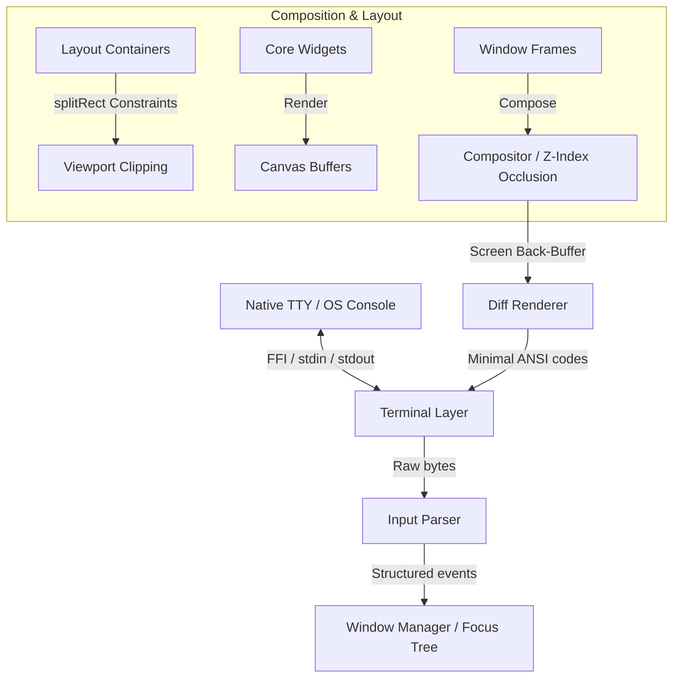

# Developer & AI Agent Handbook: CLI Experiment Windowing System

Welcome to the **cli_experiment** codebase. This document serves as a comprehensive system map and developer guide detailing the product vision, tech stack, and internal architecture. Use this guide to understand how components interact, where to make modifications, and how the underlying terminal layout engine operates.

---

## 1. Product Overview

The `cli_experiment` project is a modular, performant, double-buffered **Terminal User Interface (TUI)** and **Windowing System** written in Dart. It moves away from naive CLI output printing (which causes terminal flicker and high overhead) and provides a desktop-like environment inside standard ANSI/TTY terminal applications.

### Key Capabilities
- **Overlapping Window Management**: Supports floating, draggable, and resizeable frames with custom titles, borders, and Z-index layering.
- **Double Buffering**: Prevents terminal flickering by maintaining an in-memory frame buffer of what is visible on-screen and comparing it with a previous frame to compute delta updates.
- **Minimal ANSI Diffing**: Emits the shortest possible terminal sequences (cursor jumps and style transitions) to repaint only the modified cells.
- **Layout Solver**: Flexible constraints layout system featuring fixed size, percentage, flex (proportional), and min-max boundaries.
- **Hierarchical Input & Focus System**: Translates raw ANSI byte streams from `stdin` into high-level event objects (keys, mouse clicks/scrolls/drags, paste segments) and dispatches them down a keyboard focus node tree.
- **Modular Widget Toolkit**: Standard widgets including paragraph wrappers, lists, interactive input fields with visual cursors, progress bars, a braille-based grid canvas, tile maps, and menu overlays.

---

## 2. Tech Stack

The project runs on the Dart environment and depends on lightweight packages to coordinate raw input parsing and native Windows support:

- **Dart SDK**: `^3.10.0` (utilizes modern Dart collections, record matching, and extensions).
- **Core Dependencies**:
  - `dart:ffi`: Crucial for loading platform C libraries (`libc.so.6` or `/usr/lib/libSystem.dylib` on Unix) to configure standard input raw mode, and querying terminal sizes.
  - [package:win32](file:///app/pubspec.yaml#L17) (`^5.5.4`): Enables native console state manipulation (`SetConsoleMode`, `GetConsoleScreenBufferInfo`) on Windows.
  - [package:ffi](file:///app/pubspec.yaml#L14) (`^2.1.3`): Allocates C structures and handles pointer conversions for FFI.
  - [package:characters](file:///app/pubspec.yaml#L12) (`^1.3.0`): Treats user-perceived grapheme clusters correctly (correctly handling multi-byte characters, ZWJ sequences, and emojis).
  - [package:ansicolor](file:///app/pubspec.yaml#L10) (`^2.0.3`): Utilities for 8-bit color pen styling.
  - [package:args](file:///app/pubspec.yaml#L11) (`^2.4.2`): Standard CLI command-line arguments parsing.
  - [package:quiver](file:///app/pubspec.yaml#L15) (`^3.2.2`): Collection and comparison utility helpers.
- **Development Dependencies**:
  - [package:test](file:///app/pubspec.yaml#L16) (`^1.25.8`): Framework for running unit and integration tests.
  - [package:lints](file:///app/pubspec.yaml#L20) (`^6.0.0`): Static analysis and formatting.

---

## 3. Architecture & Subsystems

The system is structured as a series of layered abstractions from the native operating system TTY layer to the user-facing widgets.

### A. Terminal Layer (`lib/terminal/`)
Responsible for switching terminal input modes, polling window sizes, and handling low-level byte channels.

- **[Terminal](file:///app/lib/terminal/terminal.dart)**: The main interface exposing screen sizing, SIGWINCH size observers (or polling on Windows), and raw input streams.
- **[Terminal raw factory](file:///app/lib/terminal/raw/terminal.dart)**: Dispatches implementation classes:
  - **[UnixTerminal](file:///app/lib/terminal/raw/unix_terminal.dart)**: Interacts with libc `tcgetattr` and `tcsetattr` via FFI, disabling terminal echo, canonical processing (`ICANON`), and signal processing (`ISIG`).
  - **[WindowsTerminal](file:///app/lib/terminal/raw/windows_terminal.dart)**: Uses FFI to invoke Windows APIs for TTY controls.

### B. Input Processing Layer (`lib/ui/event.dart` & `lib/ui/input_parser.dart`)
Transforms streams of terminal bytes into typed events.

- **[InputParser](file:///app/lib/ui/input_parser.dart)**: Uses a state machine to decode keyboard letters, arrows, function keys (F1–F12) with modifiers (Shift, Alt, Control, Meta), SGR/X10 mouse coordinates, paste blocks (Bracketed Paste Mode), and focus change notifications.
- **[InputEvent Classes](file:///app/lib/ui/event.dart)**:
  - `KeyEvent`: Key types and active modifiers.
  - `MouseEvent`: Positions, click types (press, release, drag, move), and scroll wheels.
  - `PasteEvent`: Text pasted from clipboard.
  - `FocusInEvent` / `FocusOutEvent`: State transitions of terminal window focus.

### C. Double Buffering & Compositing (`lib/ui/buffer.dart` & `lib/ui/renderer.dart`)
Manages screen pixels in-memory to execute fast diff-based frame repaints.

- **[Cell](file:///app/lib/ui/buffer.dart#L8)**: Represents a single coordinates atom. Contains a single character grapheme cluster and a [Style](file:///app/lib/ui/style.dart) (combining RGB [Colors](file:///app/lib/ui/color.dart) and bitmask attributes like bold, dim, underline, reverse, and transparency).
- **[Buffer](file:///app/lib/ui/buffer.dart#L49)**: Grid layout representing a rectangular viewport.
- **[Compositor](file:///app/lib/ui/buffer.dart#L149)**: Composites multiple `LayeredBuffer` components onto a single target screen buffer. It employs a bit-packed `Uint32List` occlusion map to perform an early-exit optimization (skipping drawing cells that are obscured by solid higher Z-index layers).
- **[Renderer](file:///app/lib/ui/renderer.dart)**: Diffs `backBuffer` against `frontBuffer` and outputs minimal ANSI escape updates.
  - Supports `RenderingMode.alternateScreen` (absolute full screen addresses).
  - Supports `RenderingMode.inline` (relative offset moves, enabling inline CLI animations/controls without screen clearing).

### D. Layout & Widget Engine (`lib/ui/layout.dart` & `lib/ui/widgets/`)
Builds structured layout frames and exposes standard widgets. The widgets are organized modularly under `lib/ui/widgets/` and re-exported via [widget_toolkit.dart](file:///app/lib/ui/widget_toolkit.dart).

- **[splitRect](file:///app/lib/ui/layout.dart#L162)**: Splits bounding boxes into coordinates based on constraints (`LengthConstraint`, `PercentageConstraint`, `FlexConstraint`, and `MinMaxConstraint`).
- **[Viewport](file:///app/lib/ui/layout.dart#L82)**: Implements `Buffer` wrapping to clip and translate relative local coordinate spaces for nested widgets.
- **Layout Containers**: `Column`, `Row`, and `Stack` layout managers align lists of flex widgets.
- **Widgets Directory (`lib/ui/widgets/`)**:
  - `Text` ([text.dart](file:///app/lib/ui/widgets/text.dart)): Renders plain or wrapped text.
  - `RichText` ([rich_text.dart](file:///app/lib/ui/widgets/rich_text.dart)): Renders styled rich text runs with text wrapping support.
  - `ListWidget` ([list_widget.dart](file:///app/lib/ui/widgets/list_widget.dart)): Navigable scroll list.
  - `TextField` ([text_field.dart](file:///app/lib/ui/widgets/text_field.dart)): Single-line or multi-line interactive text entry field with custom cursor, placeholders, and history stacks.
  - `LinearProgressIndicator` ([linear_progress_indicator.dart](file:///app/lib/ui/widgets/linear_progress_indicator.dart)): Unicode block progress indicator with easing support.
  - `Canvas` ([canvas.dart](file:///app/lib/ui/widgets/canvas.dart)): 2D Braille grid pixel drawing tool.
  - `Grid` ([grid.dart](file:///app/lib/ui/widgets/grid.dart)): 2D tile map layer.
  - `NumberSelector` ([number_selector.dart](file:///app/lib/ui/widgets/number_selector.dart)): Spinner control.
  - `Padding` ([padding.dart](file:///app/lib/ui/widgets/padding.dart)): Wraps a child widget, shrinking viewport bounds by specified top/bottom/left/right padding offsets.
  - `Help` ([help.dart](file:///app/lib/ui/widgets/help.dart)): Flexible keybindings help line builder.
  - `Spinner` ([spinner.dart](file:///app/lib/ui/widgets/spinner.dart)): Animated progress loading indicator.
  - `Table` ([table.dart](file:///app/lib/ui/widgets/table.dart)): Multi-column grid viewer with header division and selected row cursor tracking.
  - `Paginator` ([paginator.dart](file:///app/lib/ui/widgets/paginator.dart)): Navigation dot indicator.

### E. Focus & Window Management (`lib/ui/window.dart`)
Coordinates windows, window hierarchies, drag/resize events, and focus targets.

- **[FocusNode](file:///app/lib/ui/window.dart#L7)**: Represents a leaf or branch in the active keyboard focus tree. Handles request queries and root traversal.
- **[Window](file:///app/lib/ui/window.dart#L61)**: Floating widget layout frame containing borders, title overrides, and drag handles.
- **[WindowManager](file:///app/lib/ui/window.dart#L152)**: Manages mouse drag-to-move, click-corner-to-resize, Z-indexing (bringing active windows to the front), and routing incoming key/mouse events to target focus nodes or hit positions.

---

## 4. Quick Start: Coding Guidelines

When modifying or expanding the codebase:
1. **Prefer Modern Collection Features**: In compliance with Dart collection guidelines, leverage spread operators (`...`), control-flow elements (`if`, `for`), and null-aware collection entries.
2. **Buffer Access Optimization**: Do not perform direct `stdout` writing outside the [Renderer](file:///app/lib/ui/renderer.dart) class. Perform all layout drawing operations on the widget's local [Viewport](file:///app/lib/ui/layout.dart#L82) buffer.
3. **Multi-byte Characters Safety**: When computing widths, slicing strings, or measuring layout boundaries, always use `text.characters` from `package:characters` rather than `text.length` or `text.substring` to prevent breaking multi-byte unicode or emoji sequences.
