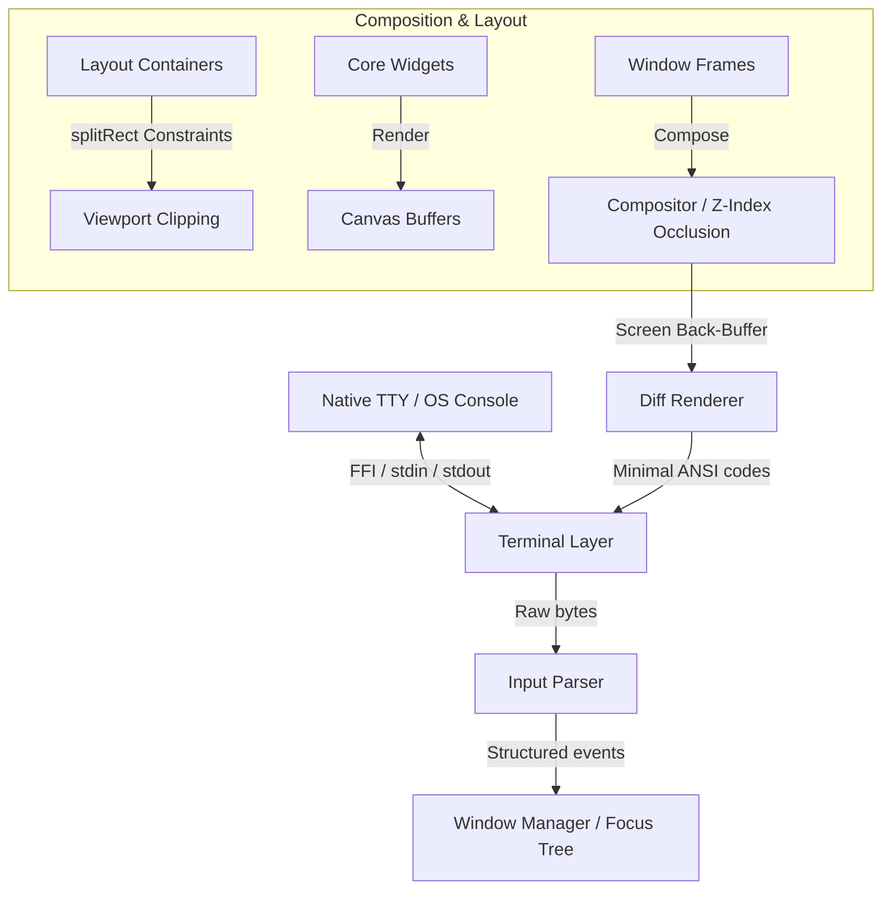

# termui

A modular, high-performance **Terminal User Interface (TUI)** and **Windowing System** for Dart.

This library shifts away from naive command-line printing (which causes terminal flickering and excessive CPU overhead) to provide a desktop-like windowed environment inside standard ANSI/TTY terminal applications.

<video src="https://github.com/user-attachments/assets/a850086b-de1b-4fda-86f0-c97e339ff271" width="100%" autoplay loop muted controls></video>

---

> [!WARNING]
> **Experimental Status:** This project is highly experimental and currently under active development. The APIs are subject to change, and features are being added and refactored frequently. It is not recommended for production use yet.

---

## Features

- **Overlapping Window Management**: Supports floating, draggable, and resizable window frames with titles, custom borders, and dynamic Z-index layering.
- **Double Buffering**: Eliminates terminal flickering by maintaining an in-memory frame buffer of what is visible on-screen and comparing it with a previous frame to compute delta updates.
- **Minimal ANSI Diffing**: Emits the shortest possible terminal sequences (cursor jumps and style transitions) to repaint only the modified cells.
- **Layout Solver**: Flexible constraints layout system featuring fixed size, percentage, flex (proportional), and min-max boundaries.
- **Hierarchical Input & Focus System**: Translates raw ANSI byte streams from `stdin` into high-level event objects (keys, mouse clicks/scrolls/drags, paste segments) and dispatches them down a keyboard focus node tree.
- **Vector Graphics & Braille Canvas**: Features a 2D sub-pixel braille-based grid canvas with antialiasing controls, filled polygons (triangles, rectangles), RGB coloring, and transformations.
- **Modular Widget Toolkit**: Standard widgets including paragraphs, lists, text inputs, text areas with cursors, progress bars, tables, paginators, spinners, and trees.

---

## Tech Stack

The project runs on the Dart environment and depends on lightweight packages to coordinate raw input parsing and native Windows support:

- **Dart SDK**: `^3.10.0` (utilizes modern Dart collections, record matching, and extensions).
- **Core Dependencies**:
  - `dart:ffi`: Loads platform C libraries (`libc.so.6` or `/usr/lib/libSystem.dylib` on Unix) to configure standard input raw mode, and queries terminal sizes.
  - `package:win32` (`^5.5.4`): Enables native console state manipulation (`SetConsoleMode`, `GetConsoleScreenBufferInfo`) on Windows.
  - `package:ffi` (`^2.1.3`): Allocates C structures and handles pointer conversions for FFI.
  - `package:characters` (`^1.3.0`): Treats user-perceived grapheme clusters correctly (correctly handling multi-byte characters, ZWJ sequences, and emojis).
  - `package:ansicolor` (`^2.0.3`): Utilities for 8-bit color pen styling.
  - `package:args` (`^2.4.2`): Standard CLI command-line arguments parsing.
  - `package:quiver` (`^3.2.2`): Collection and comparison utility helpers.
- **Development Dependencies**:
  - `package:test` (`^1.25.8`): Framework for running unit and integration tests.
  - `package:lints` (`^6.0.0`): Static analysis and formatting.

---

## Architecture

The library is structured as a series of layered abstractions, spanning from the native operating system TTY layer to user-facing widgets.



### Subsystems

1. **Terminal Layer (`lib/terminal/`)**: Switches terminal input modes (raw mode vs. canonical), polls/monitors window sizes, and manages the FFI bindings for Unix (`UnixTerminal`) and Windows (`WindowsTerminal`).
2. **Input Processing (`lib/ui/event.dart`, `lib/ui/input_parser.dart`)**: Decodes keyboard letters, control keys, arrow keys with modifiers, SGR/X10 mouse coordinates, paste blocks, and focus notifications into structured event classes.
3. **Double Buffering & Compositing (`lib/ui/buffer.dart`, `lib/ui/renderer.dart`)**: Holds cell states (grapheme + `Style`) in memory. The compositor optimizes Z-index rendering with an occlusion map. The renderer diffs front/back buffers to send minimal ANSI escape updates to stdout.
4. **Layout & Widget Engine (`lib/ui/layout.dart`, `lib/ui/widgets/`)**: Provides container managers (`Column`, `Row`, `Stack`) aligning widgets using `splitRect` constraints, and wraps coordinates/clipping with relative `Viewport` spaces.
5. **Focus & Window Management (`lib/ui/window.dart`)**: Manages overlapping window composition, mouse drag-to-move/click-to-resize operations, Z-ordering, and routes input events down the keyboard focus node tree.

---

## Running Examples

To check out the windowing system and widgets, run any of the built-in examples:

```bash
# 1. Runs the comprehensive interactive widget book
dart run example/widget_book.dart

# 2. Runs the interactive window manager demo
dart run example/window_manager_interactive.dart

# 3. Runs the sub-pixel vector graphics braille canvas demo
dart run example/braille_canvas.dart

# 4. Runs a basic layout container alignment demo
dart run example/layout_demo.dart
```

## Testing

To run all unit and integration tests:

```bash
dart test
```
