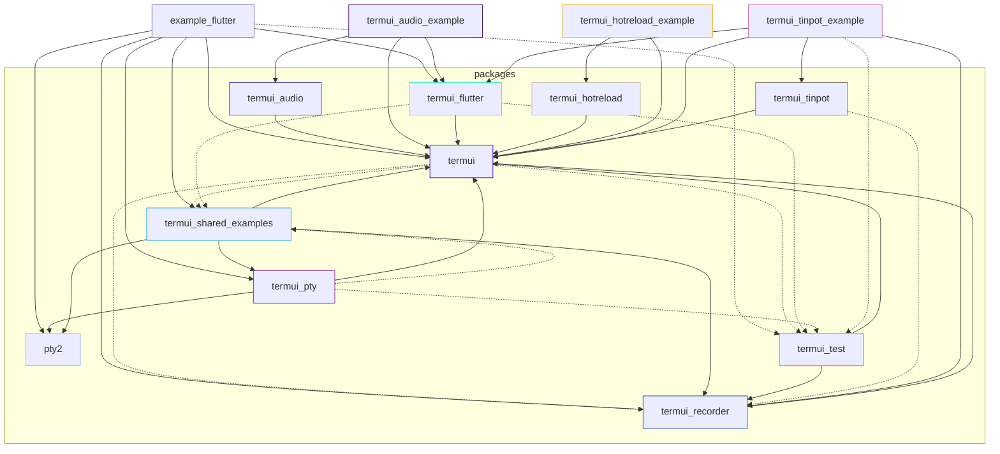

# termui

A modular, high-performance **Terminal User Interface (TUI)** and **Windowing System** for Dart.

This library shifts away from naive command-line printing (which causes terminal flickering and excessive CPU overhead) to provide a desktop-like windowed environment inside standard ANSI/TTY terminal applications.

<video src="https://github.com/user-attachments/assets/a850086b-de1b-4fda-86f0-c97e339ff271" width="100%" autoplay loop muted controls></video>

---

> [!WARNING]
> **Experimental Status:** This project is experimental and currently under active development. The APIs are subject to change, and features are being added and refactored frequently. If you want to use it, reach out and give feedback!

---

## Features

- **Overlapping Window Management**: Supports floating, draggable, and resizable window frames with titles, custom borders, and dynamic Z-index layering.
- **Double Buffering**: Eliminates terminal flickering by maintaining an in-memory frame buffer of what is visible on-screen and comparing it with a previous frame to compute delta updates.
- **Minimal ANSI Diffing**: Emits the shortest possible terminal sequences (cursor jumps and style transitions) to repaint only the modified cells.
- **Layout Solver**: Flexible constraints layout system featuring fixed size, percentage, flex (proportional), and min-max boundaries.
- **Hierarchical Input & Focus System**: Translates raw ANSI byte streams from `stdin` into high-level event objects (keys, mouse clicks/scrolls/drags, paste segments) and dispatches them down a keyboard focus node tree.
- **Vector Graphics & Braille Canvas**: Features a 2D sub-pixel braille-based grid canvas with antialiasing controls, filled polygons (triangles, rectangles), RGB coloring, and transformations.
- **Modular Widget Toolkit**: Standard widgets including paragraphs, lists, text inputs, text areas with cursors, progress bars, tables, paginators, spinners, and trees.

---

## Screenshots

<video src="https://github.com/user-attachments/assets/e7975a3a-0732-4f54-a987-49b0375bd307" width="50%" autoplay loop muted controls></video>

---

## Package Deps

