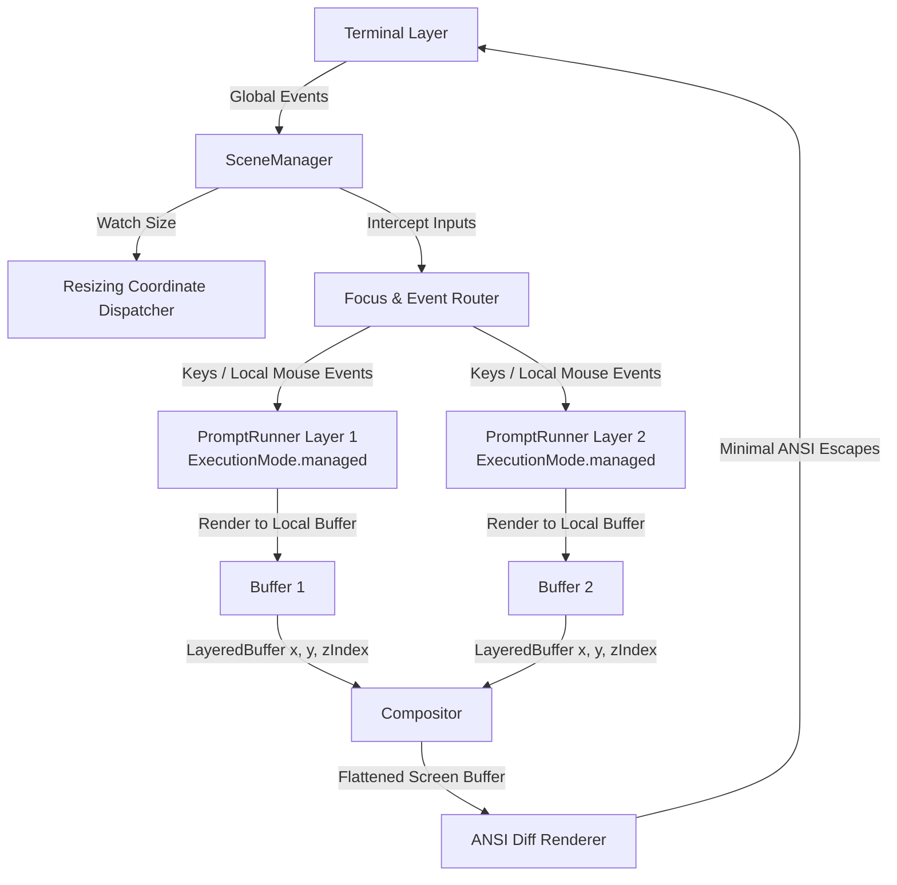

# termui

A high-performance, double-buffered **Terminal User Interface (TUI)** and **declarative layout engine** for Dart.

`termui` enables you to build complex, rich, and highly interactive terminal applications with overlapping windows, layout grids, and a widget tree structure inspired by Flutter; without the performance pitfalls, low-level ANSI complexity, or terminal flickering of naive CLI output printing.

<video src="https://github.com/user-attachments/assets/a850086b-de1b-4fda-86f0-c97e339ff271" width="100%" autoplay loop muted controls></video>

---

## Why termui?

- **Double-Buffered Rendering**: Maintains an in-memory representation of the screen and performs delta diffing against the previous frame, emitting only the minimal ANSI escape sequences required to repaint modified cells. Say goodbye to terminal flicker!
- **Flutter-Inspired Declarative Layouts**: Design layouts using container widgets like `Column`, `Row`, and `Stack`, structured with constraints (`LengthConstraint`, `PercentageConstraint`, `FlexConstraint`).
- **Complete Focus Node Tree & Input Dispatcher**: Translates raw stdin byte sequences into mouse, keyboard, paste, and focus events, automatically routing them down a Focus tree.
- **Floating Overlapping Windows**: Native window manager supporting movable, resizable, and overlapping windows with customizable Z-indices, border decorations, and focus highlights.
- **Rich Widget Toolkit**: Exposes fully-functional components: navigable lists, single/multiline text input fields with cursors, tables, custom borders, animated progress indicators, custom spinner icons, and more.
- **Web & Flutter Embedding**: By decoupling the rendering interface from native OS streams, the exact same TUI logic can be embedded directly into a Flutter application or web canvas using the complementary [`termui_flutter`](../termui_flutter) package.
- **2D Sub-pixel Braille Graphics**: Contains a 2D sub-pixel braille drawing canvas for plotting antialiased filled polygons, charts, vector lines, and radars directly in a text grid.

---

## Interactive Demo

See what is possible with `termui` in your browser! Check out our live interactive web demo hosting the entire Widget Book:

  **[Live Web Demo](https://jtmcdole.github.io/termui/)**

---

## Installation

Add `termui` to your `pubspec.yaml`:

```yaml
dependencies:
  termui: ^0.1.0-alpha.1
```

---

## Simple Compilable Example

Below is a complete, clean, and compilable example of building a terminal application with an interactive layout and input loop:

```dart
import 'dart:async';
import 'package:termui/termui.dart';

void main() async {
  // Run inside runGuarded to restore raw mode and cursor settings on crash/exit.
  await Terminal.runGuarded((terminal) async {
    // 1. Initialize terminal screen and setup mode
    terminal.enterAlternateScreen();
    terminal.hideCursor();
    terminal.enableMouseTracking();

    final termSize = await terminal.size;
    var width = termSize.x;
    var height = termSize.y;

    // 2. Initialize the offscreen draw buffer and the delta renderer
    final buffer = Buffer.blank(width, height);
    var renderer = Renderer(width, height, mode: RenderingMode.alternateScreen);

    var counter = 0;

    // 3. Define the UI rendering method
    void drawFrame() {
      buffer.clear();

      // Build a declarative layout tree (Column -> Center -> Text)
      final layout = Column([
        SizedBox(
          height: 1,
          child: Text(
            ' termui Counter Demo ',
            style: const Style(
              foreground: Colors.white,
              background: Colors.blue,
              modifiers: Modifier.bold,
            ),
          ),
        ),
        Expanded(
          child: Center(
            child: Text(
              'Counter Value: $counter\n\nPress [+] to increment, [-] to decrement.\nPress [Q] or Ctrl+C to exit.',
              style: const Style(foreground: Colors.yellow),
              textAlign: TextAlign.center,
            ),
          ),
        ),
        SizedBox(
          height: 1,
          child: Text(
            ' Current Terminal size: ${width}x${height} ',
            style: const Style(foreground: Colors.black, background: Colors.orange),
          ),
        ),
      ]);

      // Render the layout elements onto the offscreen buffer
      final rootElement = layout.createElement()..mount(null);
      rootElement.layout(BoxConstraints.tight(Size(width, height)));
      rootElement.paint(buffer, Offset.zero);
      rootElement.unmount();

      // Compute diff and write ANSI sequences to stdout
      final sb = StringBuffer();
      renderer.render(buffer, sb);
      if (sb.isNotEmpty) {
        terminal.backend.write(sb.toString());
      }
    }

    // Initial frame draw
    drawFrame();

    // 4. Listen to terminal resizing events
    final sizeSubscription = terminal.watchSize().listen((size) {
      width = size.x;
      height = size.y;
      buffer.resize(width, height);
      renderer = Renderer(width, height, mode: RenderingMode.alternateScreen);
      drawFrame();
    });

    try {
      // 5. Main event loop listening to parsed keyboard/mouse events
      await for (final event in terminal.events) {
        if (event is KeyEvent) {
          if (event.key == 'q' || event.key == 'Q') {
            break;
          }
          if (event.key == '+') {
            counter++;
            drawFrame();
          } else if (event.key == '-') {
            counter--;
            drawFrame();
          }
        }
      }
    } finally {
      // Clean up sizing subscription
      await sizeSubscription.cancel();
      // Terminal.runGuarded automatically restores standard screen and cursor.
    }
  });
}
```

---

## Scene Management and Managed Prompt Execution

For complex terminal layouts (such as overlapping draggable windows, multi-pane sidebars, or stacked layouts), `termui` provides a composited windowing system managed by `SceneManager` and `PromptRunner`.



### Managed Execution Mode (`ExecutionMode.managed`)

By default, a `PromptRunner` executes in `ExecutionMode.standalone`. In standalone mode, the runner directly binds to low-level hardware streams: it listens to global terminal sizing events, captures input streams, and writes ANSI escape updates directly to `stdout`.

When integrated into a layered UI, `PromptRunner` instances run in **managed mode** (`ExecutionMode.managed`):
* **Bypassed Hardware Streams**: The runner does not hook into `terminal.events` or `terminal.watchSize()`, and skips writing ANSI updates to `stdout`.
* **Delegated Rendering**: The runner acts strictly as a `SceneRenderer` layer. It builds and manages its local widget element tree and renders onto its own offscreen `Buffer` (exposed via `currentBuffer`).
* **Asynchronous Integration**: The runner is started asynchronously (e.g., via `unawaited(runner.run())`) to initialize state owners and mount element trees without taking control of the global application thread/event loop.

### SceneManager: The Root Orchestrator

The `SceneManager` serves as the global coordinator and compositor for all active `SceneLayer` instances.

1. **Event Capture & Routing**:
   * **KeyEvents**: Keyboard events are intercepted globally by the `SceneManager` and forwarded directly to the `SceneRenderer` of the active `focusedLayer` via `handleKeyEvent(event)`.
   * **MouseEvents**: The manager performs spatial hit-testing on global coordinates using layer bounding boxes sorted by `zIndex`. On `press`, it changes the `focusedLayer` to the clicked layer. It translates coordinates from global values into layer-relative local offsets before forwarding the event via `handleMouseEvent(localEvent)`.
   * **Dragging**: If a layer is marked `draggable` and clicked, `SceneManager` tracks dragging coordinates, updates the layer's offset (`x`, `y`), and schedules screen composition repaints.
2. **Resizing Propagation**:
   * The manager observes global terminal resizing events (`SIGWINCH` or polling).
   * Repositioning: Fullscreen layers (`LayerSizing.fullscreen`) are automatically reset to `(0, 0)`.
   * Propagation: The manager delegates size changes downwards, invoking `layer.renderer.resize(width, height)` on affected layer renderers so they resize their internal buffers and recalculate layouts.
3. **Double-Buffered Compositing**:
   * During a frame repaint (`SceneManager.render()`), the manager collects buffers from all active layers.
   * It wraps them in `LayeredBuffer` instances containing the layer's current offset and Z-index.
   * It delegates the composition to `Compositor.composite(...)`, which uses a bit-packed occlusion map to optimize rendering by skipping cell draws that are obscured by solid overlapping layers of a higher Z-index.
   * The resulting flattened screen buffer is compared against the previous frame using `Renderer` to write the minimal ANSI diff updates to the terminal.
4. **Hardware State Synchronization**:
   * `SceneManager` inspects the active layer's `TerminalStateRequest` properties (`showsCursor`, `requestedCursorPosition`, and `wantsMouseTracking`).
   * It coordinates native terminal configuration (toggling mouse tracking and cursor visibility) and repositions the physical terminal cursor at the correct absolute coordinate.

---

## Running the Examples

Navigate to the `termui` package directory first, then run the showcase examples:

```bash
# Navigate to package directory
cd packages/termui

# A comprehensive interactive layout and widget explorer
dart run example/widget_book.dart

# An overlapping window manager with draggable and resizable borders
dart run example/window_manager_interactive.dart

# Sub-pixel rendering on a vector braille canvas
dart run example/braille_canvas.dart

# Basic layout constraints alignment container
dart run example/layout_demo.dart
```

---

## Flutter & Web Support

To host a `termui` TUI application in a graphical environment (e.g. within a Flutter mobile/desktop widget or a browser canvas), check out the companion package:

  **[termui_flutter](../termui_flutter)**

---

## License

This project is licensed under the MIT License - see the [LICENSE](../../LICENSE) file for details.
