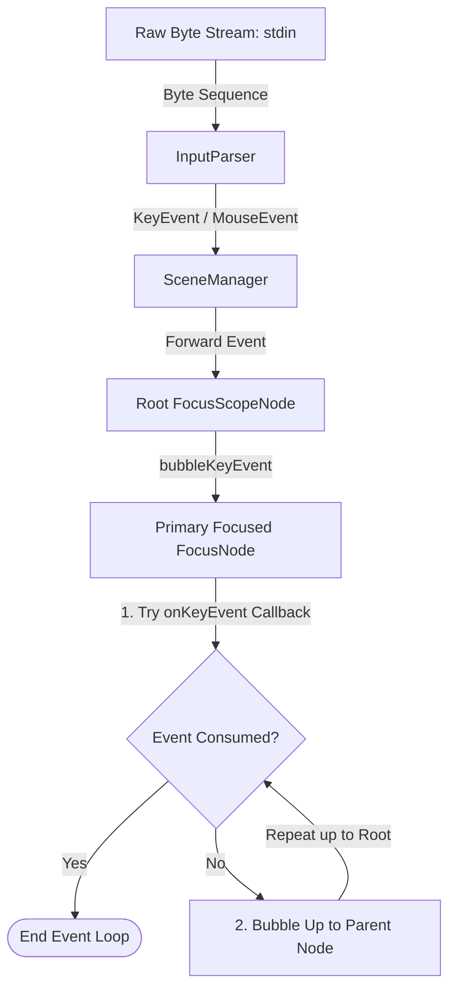
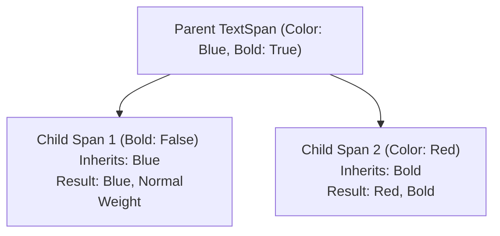
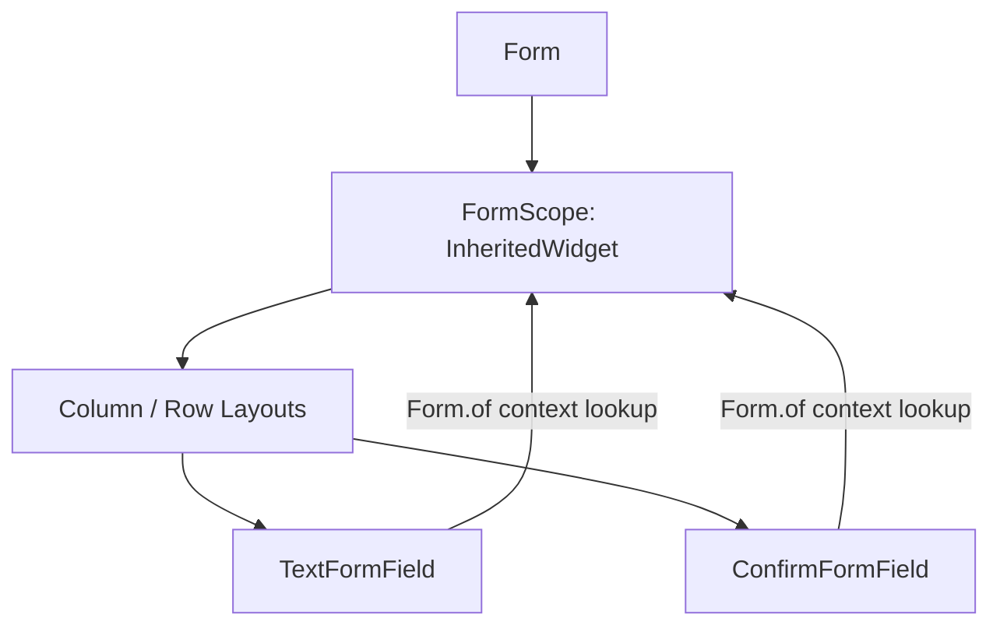

# TermUI Phase 4: Interactive Forms, Focus Trees, & Rich Text Guide

This guide details how to build rich, interactive terminal user interfaces (TUIs) using `termui`'s Flutter-aligned declarative widgets.

---

## 1. Focus Tree & Keyboard Input Pipeline

`termui` implements a declarative focus tree. Key events are captured from the standard input stream and processed through a structured dispatch and bubbling pipeline.

### Input Propagation Lifecycle



### Focus and FocusScope Node Classes

* **`FocusNode`**: A handle that represents an interactive widget's focus state. Handles focus requests, tracks whether it has focus, and processes key events via `onKeyEvent`.
* **`FocusScopeNode`**: A specialized focus node that groups child focus nodes and manages focus traversal (e.g., cycling focus via Tab or Shift-Tab).

#### Focus Tree API Reference

| Class / Property / Method | Description | Return Type / Options |
| :--- | :--- | :--- |
| `FocusNode.requestFocus()` | Requests primary keyboard focus for this node. Unfocuses previously active siblings and traverses up to activate ancestor scopes. | `void` |
| `FocusNode.unfocus()` | Resets focus state for this node and any focused descendants. | `void` |
| `FocusScopeNode.nextFocus()` | Cycles focus forward to the next sibling in the scope's focus list. | `void` |
| `FocusScopeNode.previousFocus()` | Cycles focus backward to the previous sibling in the focus list. | `void` |

### Using the `Focus` Widget

The `Focus` widget mounts and manages a `FocusNode` reactively within the widget tree:

```dart
Focus(
  autofocus: true,
  onKeyEvent: (node, event) {
    if (event.key == 'q') {
      exit(0);
    }
    return false; // let event bubble
  },
  child: MyInteractiveWidget(),
)
```

---

## 2. Text & Nestable Styling Tree (`RichText` & `TextSpan`)

Formatting text in standard terminals requires applying ANSI escape codes. `termui` abstracts this using a nestable styling tree matching Flutter's `RichText` architecture.

### Nested Style Inheritance

A parent `TextSpan` propagates its styling properties to its children. A child `TextSpan` can override specific attributes while inheriting the rest of the style.



### Code Example: Composing Styled Text

```dart
RichText(
  textAlign: TextAlign.center,
  wrap: true,
  text: TextSpan(
    style: Style(foreground: CharmColors.squid),
    children: [
      TextSpan(
        text: 'Welcome to ',
      ),
      TextSpan(
        text: 'TermUI',
        style: Style(
          foreground: CharmColors.charple,
          modifiers: Modifier.bold | Modifier.underline,
        ),
      ),
      TextSpan(
        text: '! The TUI framework.',
      ),
    ],
  ),
)
```

---

## 3. Dynamic Inherited Forms & Text Controllers

`termui` provides form validation, field registration, reset capabilities, and text state management using an InheritedWidget context walk.

### Form Context Architecture

Instead of providing a static list of fields, `Form` acts as a container. Form fields register themselves dynamically via `BuildContext` from any location in the subtree.



### Managing State with `TextEditingController`

`TextEditingController` separates raw text buffer mutations from the presentation widget. It maintains the current value, selection, and undo/redo stacks.

```dart
final controller = TextEditingController(text: 'Initial text');

// Listen to value changes
controller.addListener(() {
  print('Text updated: ${controller.text}');
});

// Programmatically modify text
controller.text = 'New programmatic text';

// Undo / Redo
controller.undo();
controller.redo();
```

### Standard Form Fields

| Field Class | Value Type | Interactive Keys |
| :--- | :--- | :--- |
| `TextFormField` | `String` | Normal typing, Backspace, arrows |
| `TextAreaFormField` | `String` | Typing, Enter (newlines), Backspace, arrows |
| `SelectFormField` | `T` (Generic) | Up Arrow, Down Arrow (select single option) |
| `ConfirmFormField` | `bool` | Left Arrow, Right Arrow, Space (Toggle Yes/No) |
| `MultiSelectFormField`| `List<T>` | Up/Down (navigate options), Space/Enter (toggle selection) |

---

## 4. Assembly Blueprints: Creating Complex UI Panels

This example demonstrates how to combine layout boxes, single child scroll views, left borders, focus trees, and forms into a cohesive dashboard screen.

```dart
import 'dart:io';
import 'package:termui/ui/buffer.dart';
import 'package:termui/ui/layout.dart';
import 'package:termui/ui/event.dart';
import 'package:termui/ui/widget_toolkit.dart';

Widget buildDashboard() {
  final nameController = TextEditingController();
  final messageController = TextEditingController();

  return Form(
    child: Row([
      // Sidebar Panel
      Flexible(
        flex: 1,
        child: LeftBorder(
          char: '│',
          style: const Style(foreground: CharmColors.squid),
          child: Column([
            const Text('NAVIGATION', style: Style(modifiers: Modifier.bold)),
            const SizedBox(height: 1),
            const Text('1. Dashboard'),
            const Text('2. Settings'),
            const Text('3. System Logs'),
          ]),
        ),
      ),
      
      // Main Form Panel
      Flexible(
        flex: 3,
        child: Padding(
          padding: const EdgeInsets.symmetric(horizontal: 2),
          child: Column([
            const RichText(
              text: TextSpan(
                text: 'SYSTEM SETUP FORM',
                style: Style(modifiers: Modifier.bold),
              ),
            ),
            const SizedBox(height: 1),
            TextFormField(
              label: 'Administrator Name',
              description: 'Enter the full name for the admin account',
              controller: nameController,
              validator: (val) => (val == null || val.isEmpty) ? 'Name is required' : null,
            ),
            TextAreaFormField(
              label: 'Welcome Message',
              description: 'Enter the motd shown on logon',
              controller: messageController,
              fieldHeight: 4,
            ),
            ConfirmFormField(
              label: 'Enable SSH Tunnel',
              description: 'Expose dashboard to external connections',
              initialValue: false,
            ),
          ]),
        ),
      ),
    ]),
  );
}
```
