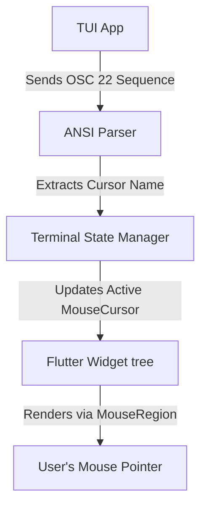

# Implementing OSC 22 Mouse Pointer Support in termui_flutter

This document outlines the design and implementation for supporting programmatic mouse cursor shape changes (`OSC 22`) in a Flutter-based terminal emulator or TUI viewer (`termui_flutter`).

By implementing this, terminal applications can change the mouse pointer dynamically (e.g., displaying a pointing hand on buttons, a crosshair for precision input, or an hourglass during loading states).

---

## Architecture Overview



---

## Implementation Details

### 1. Cursor Name Mapping
Define a mapping utility to translate the standard `OSC 22` cursor string names to Flutter's native `SystemMouseCursors` constants:

```dart
import 'package:flutter/services.dart';
import 'package:flutter/widgets.dart';

/// Maps the standard OSC 22 mouse cursor name strings to Flutter [MouseCursor]s.
MouseCursor mapOsc22ToSystemCursor(String cursorName) {
  switch (cursorName) {
    case 'default':
      return SystemMouseCursors.basic;
    case 'text':
      return SystemMouseCursors.text;
    case 'pointer':
      return SystemMouseCursors.click;
    case 'crosshair':
      return SystemMouseCursors.precise;
    case 'help':
      return SystemMouseCursors.help;
    case 'progress':
      return SystemMouseCursors.progress;
    case 'wait':
      return SystemMouseCursors.wait;
    case 'move':
      return SystemMouseCursors.move;
    case 'not-allowed':
      return SystemMouseCursors.forbidden;
    case 'grab':
      return SystemMouseCursors.grab;
    case 'grabbing':
      return SystemMouseCursors.grabbing;
    default:
      return SystemMouseCursors.basic;
  }
}
```

---

### 2. Parse the `OSC 22` Sequence
In your ANSI/VT escape sequence parser, intercept the `OSC 22` commands:

* **Sequence Format:** `\x1b]22;<shape>\x1b\\` (ST terminator) or `\x1b]22;<shape>\x07` (BEL terminator)

```dart
void handleOscSequence(String sequence) {
  // sequence might be: "22;pointer"
  if (sequence.startsWith('22;')) {
    final cursorName = sequence.substring(3);
    final systemCursor = mapOsc22ToSystemCursor(cursorName);
    
    // Notify the UI layer to update its mouse region
    _onCursorChanged(systemCursor);
  }
}
```

---

### 3. Bind to a `MouseRegion` Widget
Wrap the main rendering surface of your terminal emulator in a `MouseRegion` widget so that Flutter dynamically handles the cursor change on hover:

```dart
class TerminalView extends StatefulWidget {
  final TerminalController controller;

  const TerminalView({Key? key, required this.controller}) : super(key: key);

  @override
  _TerminalViewState createState() => _TerminalViewState();
}

class _TerminalViewState extends State<TerminalView> {
  MouseCursor _currentCursor = SystemMouseCursors.basic;

  @override
  void initState() {
    super.initState();
    widget.controller.onMouseCursorChanged = (cursor) {
      setState(() {
        _currentCursor = cursor;
      });
    };
  }

  @override
  Widget build(BuildContext context) {
    return MouseRegion(
      cursor: _currentCursor,
      child: CustomPaint(
        painter: TerminalGridPainter(
          grid: widget.controller.grid,
        ),
      ),
    );
  }
}
```
