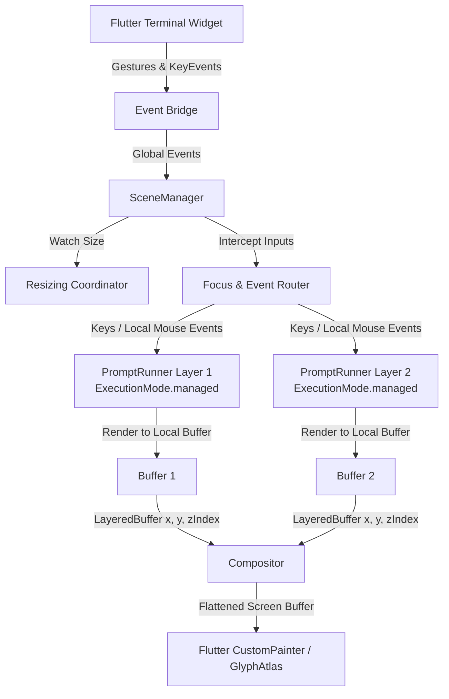

# termui_flutter

A Flutter GUI embedder and high-performance renderer for [`termui`](../termui) applications.

`termui_flutter` allows you to host fully-interactive terminal applications (TUIs) inside Flutter mobile, desktop, and web apps. It bridges Flutter's rendering pipeline and gesture/focus systems with `termui`'s state machine, double-buffered canvas, and widget engine.

<video src="https://github.com/user-attachments/assets/a92129b8-1bbb-4d74-8983-6c8de75a1962" width="100%" autoplay loop muted controls></video>

---

## Why termui_flutter?

- **Dynamic Texture Atlas**: Uses `GlyphAtlas` to rasterize monospaced terminal fonts and box-drawing/block characters directly into GPU-backed textures on-demand. This eliminates character seams, anti-aliasing artifacts, and line gaps.
- **Procedural Box Drawing**: Automatically bypasses font rendering for thin/double lines and block element unicode codes (`┌`, `─`, `█`, etc.), rendering them mathematically on the canvas for pixel-perfect grids.
- **Gesture/Input Routing**: Maps Flutter tap, drag, hover, and mouse scroll wheel gestures into SGR mouse coordinates, and translates hardware keys into standard terminal key sequences.
- **Dynamic Scale Adjustments**: Supports runtime scale modifications (increasing/decreasing font sizes), prompting the underlying terminal to re-measure boundaries and trigger fluid layout recalculations.
- **Zero Platform Channels**: Communicates purely via memory streams, ensuring standard code compatibility across Android, iOS, macOS, Windows, Linux, and web browser platforms.

---

## Interactive Demo

See `termui_flutter` running live in a web browser! Our online demo features the entire interactive Widget Book built with this package:

  **[Live Web Demo](https://jtmcdole.github.io/termui/)**

---

## Installation

Add both `termui` and `termui_flutter` to your `pubspec.yaml`:

```yaml
dependencies:
  termui: ^0.1.0-alpha.1
  termui_flutter: ^0.1.0-alpha.1
```

---

## Simple Compilable Example

Below is a complete, clean, and compilable Flutter application hosting a interactive terminal counter:

```dart
import 'package:flutter/material.dart' hide Color;
import 'package:termui/termui.dart' as termui;
import 'package:termui_flutter/termui_flutter.dart';

void main() {
  runApp(const MyApp());
}

class MyApp extends StatelessWidget {
  const MyApp({super.key});

  @override
  Widget build(BuildContext context) {
    return MaterialApp(
      home: Scaffold(
        body: Center(
          child: SizedBox(
            width: 640,
            height: 480,
            child: Terminal(
              fontFamily: 'Cascadia Mono',
              fontSize: 14.0,
              backgroundColor: Colors.black,
              onRun: (terminal, drawFrame) async {
                final termSize = await terminal.size;
                final buffer = termui.Buffer.blank(termSize.x, termSize.y);

                var counter = 0;

                void render() {
                  buffer.clear();

                  // Build a simple layout
                  final layout = termui.Column([
                    termui.SizedBox(
                      height: 1,
                      child: termui.Text(
                        ' termui Flutter Embedded Counter ',
                        style: const termui.Style(
                          foreground: termui.Colors.white,
                          background: termui.Colors.blue,
                        ),
                      ),
                    ),
                    termui.Expanded(
                      child: termui.Center(
                        child: termui.Text(
                          'Counter: $counter\n\nClick with mouse or press [+] to increment.\nPress [-] to decrement.\nPress [q] to quit.',
                          style: const termui.Style(foreground: termui.Colors.green),
                          textAlign: termui.TextAlign.center,
                        ),
                      ),
                    ),
                  ]);

                  // Draw layout to buffer
                  final elementWrapper = termui.ElementWidget(layout);
                  elementWrapper.layout(termui.BoxConstraints.tight(termui.Size(termSize.x, termSize.y)));
                  elementWrapper.paint(buffer, termui.Offset.zero);
                  // Flush buffer to the Flutter painter
                  drawFrame(buffer);
                }

                // Initial render
                render();

                // Simple event loop handling key and mouse clicks
                await for (final event in terminal.events) {
                  if (event is termui.KeyEvent) {
                    if (event.key == 'q' || event.key == 'Q') {
                      break;
                    } else if (event.key == '+') {
                      counter++;
                    } else if (event.key == '-') {
                      counter--;
                    }
                  } else if (event is termui.MouseEvent) {
                    // Increment counter on left click
                    if (event.type == termui.MouseEventType.press &&
                        event.button == termui.MouseButton.left) {
                      counter++;
                    }
                  }
                  render();
                }
              },
            ),
          ),
        ),
      ),
    );
  }
}
```

---

## Scene Management and Managed Prompt Execution

For complex applications embedded in Flutter (such as windowed terminal terminals, multi-pane sidebars, or stacked overlapping layers), the underlying `termui` layout engine utilizes a composited system managed by `SceneManager` and `PromptRunner`.



### Managed Execution Mode (`ExecutionMode.managed`)

By default, a `PromptRunner` runs in `ExecutionMode.standalone` (hooking into raw terminal stdout, stdin, and resize signals). Under a composited GUI environment, `PromptRunner` instances run in **managed mode** (`ExecutionMode.managed`):
* **Bypassed Console I/O**: The runner disables direct platform streams (like `stdin` or `stdout`), allowing Flutter's gesture detection and hardware key listeners to bridge input events via memory streams instead.
* **Delegated Rendering**: The runner acts as a `SceneRenderer` layer. It constructs its widget element tree and renders onto a local offscreen `Buffer` (exposed via `currentBuffer`).
* **Asynchronous Integration**: The runner is initialized asynchronously (e.g., via `unawaited(runner.run())`) to mount its element tree, while screen composition is delegated entirely to the `SceneManager`.

### SceneManager: The Root Orchestrator

The `SceneManager` serves as the global coordinator and compositor for all active `SceneLayer` instances within the terminal viewport.

1. **Event Capture & Routing**:
   * **KeyEvents**: Hardware key presses captured by Flutter are bridge-forwarded to `SceneManager`. The manager routes them directly to the `SceneRenderer` of the active `focusedLayer` via `handleKeyEvent(event)`.
   * **Mouse/Gesture Events**: The manager performs spatial hit-testing using the bounding box of each layer sorted by `zIndex`. When a mouse click or tap gesture is captured, it updates focus, translates the global coordinate offset to the target layer's local coordinate system, and routes the event via `handleMouseEvent(localEvent)`.
   * **Dragging**: If a layer is marked `draggable`, the manager handles mouse click-and-drag delta streams, adjusting the layer's coordinates (`x`, `y`), and schedules the repaint.
2. **Resizing Coordination**:
   * When the Flutter widget changes size (e.g., due to window resizing or parent layout changes), the new grid size is propagated to `SceneManager`.
   * Fullscreen layers (`LayerSizing.fullscreen`) are automatically reset to `(0, 0)`.
   * The manager cascades size changes downwards, invoking `layer.renderer.resize(width, height)` on affected layer renderers so they resize their internal buffers and recalculate layouts.
3. **Double-Buffered Compositing**:
   * During a frame repaint (`SceneManager.render()`), the manager collects buffers from all active layers.
   * It wraps them in `LayeredBuffer` instances containing the layer's current offset and Z-index.
   * It delegates the composition to `Compositor.composite(...)`, which uses a bit-packed occlusion map to optimize rendering by skipping cell draws that are obscured by solid overlapping layers of a higher Z-index.
   * The final flattened screen buffer is written to the terminal backend, triggering the Flutter `CustomPainter` to repaint the grid using the high-performance GPU `GlyphAtlas`.
4. **Hardware State Synchronization**:
   * `SceneManager` inspects the active layer's `TerminalStateRequest` properties (`showsCursor`, `requestedCursorPosition`, and `wantsMouseTracking`).
   * It translates cursor rendering requests and coordinate positions into the bridge, prompting Flutter to display/hide the visual blinking caret at the correct pixel coordinate.

---

## Core package

`termui_flutter` acts strictly as the renderer and embedder interface. For standard CLI application logic, layouts, and widgets, check out the core package:
  **[termui](../termui)**

---

## License

This project is licensed under the MIT License - see the [LICENSE](../../LICENSE) file for details.
