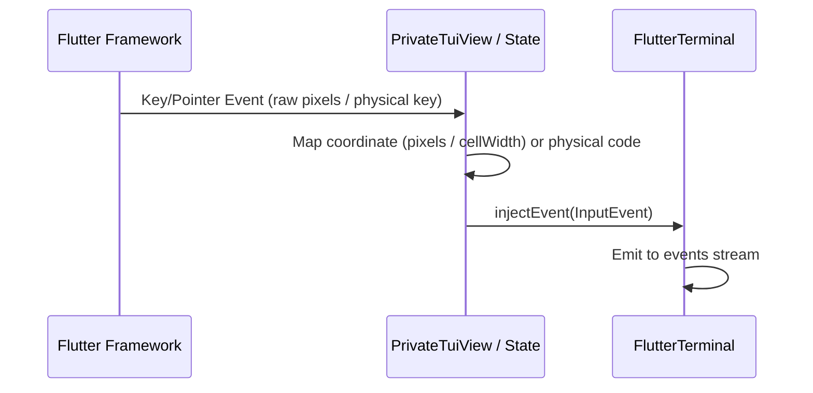

# termui_flutter

`termui_flutter` is the Flutter GUI embedding and rendering layer for the `termui` terminal user interface library. It enables standard, reactive terminal applications to be hosted seamlessly inside a Flutter application widget hierarchy.

Rather than printing ANSI sequences to standard terminal streams (`stdout`), `termui_flutter` translates TUI cell grid updates into hardware-accelerated texture paint commands using Flutter's custom painter capabilities, and bridges mouse/keyboard event loops between Flutter's event system and `termui`.term

<video src="https://github.com/user-attachments/assets/a92129b8-1bbb-4d74-8983-6c8de75a1962" width="100%" autoplay loop muted controls></video>

---

## Interactive Demo

See what is possible with `termui` in your browser! Check out our live interactive web demo hosting the entire Widget Book:

  **[Live Web Demo](https://jtmcdole.github.io/termui/)**

---

## Screenshots

<video src="https://github.com/user-attachments/assets/e7975a3a-0732-4f54-a987-49b0375bd307" width="50%" autoplay loop muted controls></video>


---

## 1. Native Embedding & Terminal Widget

The entrypoint widget for hosting a TUI application inside a Flutter layout tree is the **`Terminal`** widget, implemented in `lib/src/terminal.dart`.

### Class Definition & Configuration

The `Terminal` class is a `StatefulWidget` configured via the following properties:

```dart
class Terminal extends StatefulWidget {
  final FlutterTerminal? terminal;
  final Future<void> Function(
    FlutterTerminal terminal,
    void Function(Buffer) drawFrame,
  ) onRun;
  final double fontSize;
  final String fontFamily;
  final Color backgroundColor;

  const Terminal({
    super.key,
    this.terminal,
    required this.onRun,
    this.fontSize = 13.0,
    this.fontFamily = 'Cascadia Mono',
    this.backgroundColor = Colors.black,
  });

  @override
  State<Terminal> createState() => _TerminalState();
}
```

> [!WARNING]
> **CRITICAL FONT REQUIREMENT**: You **must** bundle a strict 1:2 aspect-ratio CLI font (such as `Cascadia Mono` or `MesloLGS NF`) in your application's `pubspec.yaml` and pass it to the `fontFamily` property.
>
> If you fail to bundle the font asset, Flutter will silently fall back to a system font. Standard system fonts typically have non-1:2 aspect ratios (e.g., 9x15) which will stretch or squash your UI layout (turning circles into ovals). Furthermore, standard fonts do not properly tile block and box-drawing elements (`█`, `▄`, `▖`), which will cause 1-pixel horizontal and vertical "bleeding" seams to appear across your terminal grid.

### Lifecycle & Hosting Pipeline

1. **Initialization (`initState`)**:
   - The state class `_TerminalState` resolves the logic controller. If no custom `FlutterTerminal` is provided in the `terminal` property, it constructs a new instance using the configured `widget.fontSize`:
     ```dart
     _terminal = widget.terminal ?? FlutterTerminal(initialFontSize: widget.fontSize);
     ```
2. **App Event Loop Launching (`_startLoop`)**:
   - A private loop launcher method `_startLoop` invokes the user's `onRun` callback.
   - It guards execution with an `_isRunning` boolean flag to prevent concurrent loop spawning.
   - The callback receives the active `_terminal` instance and a `drawFrame` dispatch callback.
3. **Rebuilds and Hot Updates**:
   - `_TerminalState` builds a **`PrivateTuiView`** widget, passing the resolved terminal instance, font configuration, background color, and the `_startLoop` frame callback hook.
4. **Clean up & Disposal**:
   - When the widget is removed from the widget tree, the `dispose()` method closes streams and disposes of the underlying `FlutterTerminal` instance *only* if it was locally created (i.e. `widget.terminal == null`).

---

## 2. Event Bridging

Keyboard focus, keystrokes, pointer interactions, and mouse scroll signals are managed by the internal widget **`PrivateTuiView`** and its state class **`_PrivateTuiViewState`** (`lib/src/terminal.dart`).



### Keyboard Focus Management

- `PrivateTuiView` manages a dedicated **`FocusNode`** to direct keystrokes.
- In the `build()` method, the viewport subtree is enclosed inside a **`Focus`** widget:
  ```dart
  Focus(
    focusNode: _focusNode,
    autofocus: true,
    onKeyEvent: (node, event) {
      _handleKeyEvent(event);
      return KeyEventResult.handled;
    },
    child: ...
  )
  ```
- Focus-handling is kept active on the widget hierarchy automatically via `autofocus: true`.

### Keystroke Translation (`_handleKeyEvent`)

Hardware events matching `KeyDownEvent` or `KeyRepeatEvent` are translated into standard `termui` key representations:
1. **Modifier Gathering**: Uses `HardwareKeyboard.instance` to query shift, alt, control, and meta modifier key states, packaging them into a `Set<term.Modifier>`.
2. **Logical Key Matching**: Direct maps are configured for layout and control actions:
   - **Arrow keys**: `LogicalKeyboardKey.arrowUp` $\rightarrow$ `'up'`, `arrowDown` $\rightarrow$ `'down'`, `arrowLeft` $\rightarrow$ `'left'`, `arrowRight` $\rightarrow$ `'right'`.
   - **Editing keys**: `home`, `end`, `delete`, `backspace`, `pageUp`, `pageDown`.
   - **Navigation & Control**: `escape`, `enter`/`numpadEnter` (mapped to `'\n'`), `tab` (mapped to `'\t'`), and `Shift+Tab` (mapped to `'backtab'`).
   - **Function keys**: `f1` through `f11`.
   - **Mathematical symbols**: `equal`/`numpadAdd` (mapped to `'+'` / `'='`), `minus`/`numpadSubtract` (mapped to `'-'`).
3. **Character extraction**: If the hardware event contains printable text (`event.character != null`), it maps the character directly. If the key label is a single character, it extracts its lowercase label.
4. **Injection**: Constructs a `term.KeyEvent(keyString, keyType, modifiers: mods)` and delivers it to the TUI via `widget.terminal.injectEvent(termEvent)`.

### Pointer & Mouse Mapping (`_handlePointerEvent`)

- Mouse clicks, drag movements, mouse hover coordinates, and scroll wheel ticks are captured by wrapping the inner terminal viewport inside a standard Flutter **`Listener`** widget.
- **Coordinate Conversion**: Pixel-based locations are mapped to discrete 1-based character grid coordinates.
  Given the local pixel coordinates (`localPosition.dx`, `localPosition.dy`), column and row metrics are computed using the current font glyph atlas metrics (`cellWidth` and `cellHeight`):
  $$col = \lfloor \frac{x_{pos}}{cellWidth} \rfloor$$
  $$row = \lfloor \frac{y_{pos}}{cellHeight} \rfloor$$
- **Clamping**: Coordinates are clamped to the current terminal grid boundaries:
  $$\text{clampedCol} = \text{clamp}(col, 0, \text{maxCol} - 1)$$
  $$\text{clampedRow} = \text{clamp}(row, 0, \text{maxRow} - 1)$$
- **Terminal Coordinate Offset**: Terminal mouse coordinates are 1-indexed. The final mouse event uses:
  $$x = \text{clampedCol} + 1$$
  $$y = \text{clampedRow} + 1$$
- **Button Mapping**:
  - `event.buttons & kSecondaryMouseButton != 0` $\rightarrow$ `MouseButton.right`
  - `event.buttons & kMiddleMouseButton != 0` $\rightarrow$ `MouseButton.middle`
  - Normal click $\rightarrow$ `MouseButton.left`
  - Scroll wheel $\rightarrow$ `MouseButton.wheelUp` / `MouseButton.wheelDown` depending on `scrollDelta.dy < 0`.
- **Event Types**: Maps pointer motions to `MouseEventType.press`, `drag`, `move`, and `release`.
- **Injection**: Fires a `term.MouseEvent` using `widget.terminal.injectEvent(term.MouseEvent(...))`.

### OSC 22 Cursor Management

`PrivateTuiView` dynamically reacts to mouse cursor overrides requested by the TUI program using OSC 22 escape sequences:
- It listens to `widget.terminal.mouseCursorChanges`.
- The sequence converts text commands (like `text`, `pointer`, `crosshair`, `grab`, `grabbing`, `none`, etc.) into Flutter's native **`SystemMouseCursors`** values (e.g. `SystemMouseCursors.click` for pointer).
- Updates the active cursor applied on the viewport wrapper **`MouseRegion`** widget.

### Diagnostics & Screenshots (F12 Key)

Pressing the `F12` key triggers a private function `_takeScreenshot()` that saves structural visual snapshots of the active terminal session to the current working directory:
1. **PNG Screen Shot**: Resolves the `RenderRepaintBoundary` key (`_boundaryKey`) and exports the rasterized canvas pixels as `screenshot_[timestamp].png`.
2. **PNG Glyph Atlas**: Saves the backing texture of the active `GlyphAtlas` as `atlas_[timestamp].png`.
3. **JSON Layout Map**: Serializes the dimensions, column/row sizes, character grid contents, cell colors, style modifiers, and exact texture source rect positions as `coordinates_[timestamp].json`.

---

## 3. Backend Communication

Communication between Flutter elements and the core TUI framework is divided between **`FlutterTerminalBackend`** and **`FlutterTerminal`** (`lib/src/backend.dart`).

```
 +------------------+               +-----------------------+
 | FlutterTerminal  | --------->    | FlutterTerminalBackend|
 +------------------+               +-----------------------+
          |                                     |
    (injectEvent)                      (write / OSC 22 parsing)
          |                                     |
          v                                     v
   [TUI Event Stream]                     [Mouse Cursor Stream]
```

### `FlutterTerminalBackend`

`FlutterTerminalBackend` implements `TerminalBackend` from the core `termui` library. It acts as an in-memory terminal instance that bypasses standard CLI input/output streams:
- **TSize Management**: Maintains the active console layout dimension in memory (`Point<int> _size`, defaulting to `80x24`). Resizing triggers size emission on a broadcast stream returned by `watchSize()`.
- **Standard Streams Bypass**: `rawInput` returns an empty stream (`Stream.empty()`), while `enableRawMode()` and `disableRawMode()` are no-ops since there are no physical stdin TTY handles to lock.
- **Escape Sequence Parsing (`write`)**:
  Terminal output sent via `write(String data)` is scanned for OSC 22 cursor control sequences:
  - It matches sequences using a regular expression:
    ```dart
    static final RegExp _osc22Regex = RegExp('\x1b\\]22;([^\x1b\x07]*)(?:\x1b\\\\|\x07)');
    ```
  - Upon matching, the capture group extracts the cursor name and dispatches it down a broadcast stream `mouseCursorChanges`.

### `FlutterTerminal`

`FlutterTerminal` extends the core `Terminal` class and manages the state machine driving the TUI loop:
- **First Layout Sizing**: Uses a `_initialSizeCompleter` to coordinate TUI startup. TUI code calling `await terminal.size` yields asynchronously until the Flutter widget tree executes its first `LayoutBuilder` phase, which determines the physical cell slots and calls `updateSize(Point(cols, rows))`.
- **Event Forwarding**: Exposes `Stream<InputEvent> get events` and provides a public method `injectEvent(InputEvent event)` allowing the keyboard and pointer listener configurations in `PrivateTuiView` to write events directly into the TUI's input stream.
- **Font Sizing API**:
  Exposes the font configuration state to let applications zoom in or out of UI frames:
  - **`fontSize`**: The current font point size.
  - **`watchFontSize()`**: A broadcast stream emitting notifications when font dimensions are modified.
  - **`setFontSize(double size)`**: Updates the active font size (clamped between `4.0` and `72.0`) and triggers an atlas regeneration.
  - **`increaseFontSize([double delta = 1.0])`** and **`decreaseFontSize([double delta = 1.0])`**: Utility scaling functions.

---

## 4. Canvas Atlas Painter

Terminal grid cells are painted on screen via **`TuiAtlasPainter`** (`lib/src/rendering/painter.dart`), a Flutter `CustomPainter`.

### Efficient Grid Batching (`drawRawAtlas`)

Drawing hundreds of individual cells using distinct canvas paint calls (like `drawRect` or text painter layouts) can easily overflow GPU command buffers and throttle frame rates. To maximize performance, `TuiAtlasPainter` performs double-buffered rendering using a single composite call to **`Canvas.drawRawAtlas`**:

1. **Sprite Sheet Mapping**:
   The painter uses the pre-rendered `GlyphAtlas` (which groups characters in a 32-column grid on a backing `ui.Image`). The background solid color is drawn using a special white cell located at character `'\uFFFF'`.
2. **Buffer Preparation**:
   The class allocates flat arrays for batch data:
   - **`Float32List transforms`**: Formatted as groups of 4 values per sprite: `[scCos, scSin, tx, ty]`. `scCos` holds the horizontal cell scale, `scSin` is `0.0` (no rotation), and `tx`, `ty` specify the screen offset coordinates.
   - **`Float32List rects`**: Bounding boxes mapping the sprite coordinates inside the glyph atlas image: `[left, top, right, bottom]`.
   - **`Int32List colors`**: The ARGB color value to blend onto the sprite texture.
3. **Double-Pass Composition**:
   - **Pass 1 (Backgrounds)**: Fills the arrays for every cell using the coordinate of `'\uFFFF'` to lay down solid background color cells.
   - **Pass 2 (Foregrounds)**: Iterates over non-empty cells. If a cell contains a character present in the atlas, it adds its transform, source rect, and foreground color arrays to the foreground buffers.
4. **GPU Chunking Optimization**:
   To prevent GPU buffer limits from dropping frames on complex grids, `_drawRawAtlasInChunks` partitions the drawing arrays into chunks of **500 sprites** before passing them to the GPU:
   ```dart
   const int chunkSize = 500;
   for (int i = 0; i < totalSprites; i += chunkSize) {
     final Float32List transformsSub = Float32List.sublistView(transforms, i * 4, end * 4);
     final Float32List rectsSub = Float32List.sublistView(rects, i * 4, end * 4);
     final Int32List colorsSub = Int32List.sublistView(colors, i, end);

     canvas.drawRawAtlas(
       image,
       transformsSub,
       rectsSub,
       colorsSub,
       BlendMode.modulate,
       null,
       paint,
     );
   }
   ```

### Procedural Drawing (`drawProceduralCharacter`)

To avoid typical anti-aliasing artifacts, line seams, and misalignment errors when displaying box lines, shades, and blocks using standard vector font rendering, the generator bypasses normal text painting for specific Unicode ranges using `drawProceduralCharacter` (`lib/src/rendering/atlas.dart`):

- **Block Elements (0x2580 - 0x259F)**: Draws precise geometric rectangles matching block widths/heights (e.g. `█` $\rightarrow$ full height, `▄` $\rightarrow$ bottom half, `▀` $\rightarrow$ top half, `▌` $\rightarrow$ left half, `▐` $\rightarrow$ right half).
- **Shade Characters (0x2591 - 0x2593)**: Draws solid cell fills with opacity blending:
  - `░` (light shade) $\rightarrow$ color with alpha `64`
  - `▒` (medium shade) $\rightarrow$ color with alpha `128`
  - `▓` (dark shade) $\rightarrow$ color with alpha `192`
- **Box-Drawing Lines (0x2500 - 0x257F)**: Computes precise vector intersections using sub-pixel lines (thin single lines use a thickness of `1.2`, double-lines use a gap of `2.0` with lines of thickness `1.0`) to paint borders that connect continuously without gaps.

### Font Fallback and Atlas Growth

```
[Character in Paint Loop]
   |
   +---> Present in Atlas? ---> Yes ---> Render via drawRawAtlas
   |
   +---> No ---> Add to Missing Glyphs List
                  |
                  +---> Trigger onMissingGlyphs()
                  |        |
                  |        +---> [Async Atlas Growth]
                  |              1. GlyphAtlas.addGlyphs()
                  |              2. Render new characters
                  |              3. Create new ui.Image
                  |              4. Dispose old ui.Image
                  |
                  +---> Render via Cached TextPainter (fallbackPainters)
```

- **Dynamic Discovery**: If the painter encounters a character that does not exist in `atlas.charRects`, it registers it in a `missingGlyphs` list and buffers it in a `_FallbackCell`.
- **Atlas Growth Callback**: After the paint cycle, `onMissingGlyphs` is invoked. `PrivateTuiView` triggers a microtask to execute `GlyphAtlas.addGlyphs(batch)`.
- **Texture Generation**:
  - The atlas creates a new canvas recording.
  - Draws the existing image at coordinates `Offset.zero`.
  - Loops over the new glyph characters, measuring them, testing baseline offsets (against character `'A'` to prevent alignment vertical jitter), and drawing them. Wide characters (like CJK and Emojis) are detected via `isWideGrapheme` and allocated 2 coordinate columns.
  - Generates a new `ui.Image` composite texture and **disposes of the old image memory** to prevent leaks.
- **Immediate Fallback Painting**: While the atlas is regenerating asynchronously, the painter falls back to painting characters using individual standard `TextPainter` widgets stored in the `fallbackPainters` cache (non-web only).

### Bleed Mitigation & Seamless Cells

- **Texture Bleeding Prevention**: To prevent GPU rendering interpolation from sampling neighboring glyph pixels on the atlas sheet, each glyph in the atlas is framed with a margin of `2.0` pixels padding.
- **Cell Seam Prevention**: Due to floating-point scaling rounding, minor black line gaps (seams) can appear between adjacent backgrounds or block characters.
  - Background cells are inflated during coordinates calculation using an overlap value: `const bleedBg = 0.5;`
  - Block characters (detected via `_isBlockCharacter`) are expanded in coordinates by `bleedFg = 0.5` pixels to overlap slightly, resulting in continuous blocks and borders.
